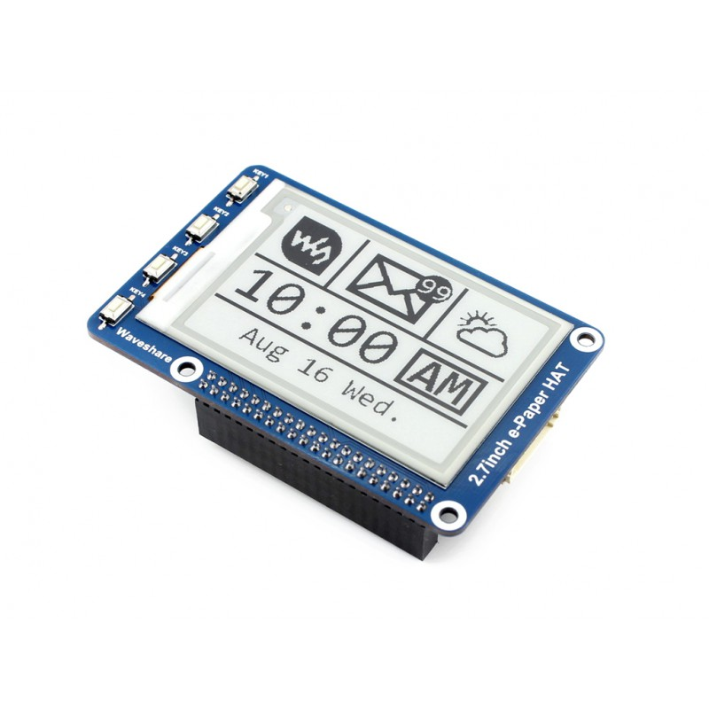

# go-epaper-demo

go-epaper-demo is an example of how to display an image to a Waveshare 2.7 inch epaper display hat with the Raspberry Pi 3 B+ written in Golang.

## running the demo

#### Setup
[Setup SPI](https://www.raspberrypi.org/documentation/hardware/raspberrypi/spi/README.md) by uncommenting `dtparam=spi=on` in `/boot/config.txt`. Then reboot `sudo reboot`.

#### Run
Run go-epaper-demo with Golang
```bash
GO111MODULE=on go run -mod=vendor .
```

Run go-epaper-demo with Docker
```
docker build . -t dmowcomber/go-epaper-demo
docker run --rm -v /dev/mem:/dev/mem --device /dev/gpiomem --device /dev/spidev0.0 dmowcomber/go-epaper-demo
```


